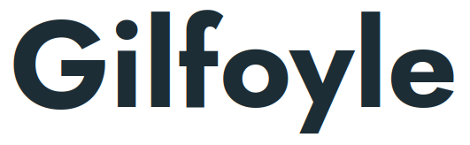

⚠️ **Development on this project has been stopped due to lack of activity. Project should be considered as unstable and outdated.**

  

Distributed video encoding, hosting and delivery. By <a href="https://dreamvo.com/"><strong>Dreamvo</strong></a>

    
    
    
    
    

Gilfoyle is a web application from the [Dreamvo project](https://dreamvo.com) that runs a self-hosted media streaming server. Allowing you to easily implement media streaming in any application at any scale.

It's written in Golang, mostly designed for [Kubernetes](http://kubernetes.io/) and runs as a single Linux binary with [PostgreSQL](https://www.postgresql.org/) and [RabbitMQ](https://www.rabbitmq.com/).

## Table of content

- [Features](#features)
- [Current status](#current-status)
- [Design](#design)
- [Roadmap](#roadmap)
- [Documentation](#documentation)
- [Contributing](#contributing)
- [Discussion](#discussion)

## Features

- Deploy a RESTful API and HLS server to manage and stream audio & video
- Handle media compression and encoding with [FFmpeg](https://ffmpeg.org/)
- Customize media renditions
- Monitoring: Prometheus exported metrics, embedded Web UI
- Media thumbnail & video preview generation
- Enjoy highly scalable & cloud-native architecture

### What's next ?

- Authentication and delegated upload
- Caption support
- Player customization
- Multi stream support (e.g: one audio stream per language)
- Live streaming
- [IPFS](https://ipfs.io/) support
- Encryption support

## Current status

It's a **Work In Progress**. As this project is very recent, it's under heavy development and not suitable for production yet. Please consider v0 as unstable. Want to contribute ? Check the [backlog](https://github.com/dreamvo/gilfoyle/projects/1).

## Design

See [this document](DESIGN.md) for a high level design and goals.

## Roadmap

### Phase 1 *(v0.1)*

This first phase aim to build a first working version of this software with a minimum of test coverage and bug fixes. The first working version is v0.1.0 whose roadmap is [available here](https://github.com/dreamvo/gilfoyle/issues/40).

### Phase 2 *(v0.x - current)*

This second phase is about getting more contributors and feedbacks to fix more bugs and improve testing. Feedbacks and tests should make us able to validate design and create a roadmap for the first stable release (v1.0.0).

- [Roadmap for v0.2.0](https://github.com/dreamvo/gilfoyle/issues/101)

### Phase 3 (v1)

This third phase should allow us to make the program more stable and welcoming to new users. Stability will make us able to publish donation goals in order to continue improve the OSS project and build a SaaS product.

## Documentation

- For **contributors**: see [godoc](https://pkg.go.dev/github.com/dreamvo/gilfoyle), [high-level design documentation](DESIGN.md)
- For **users**: see [user guide](https://gilfoyle.dreamvo.com/) and [API documentation](https://petstore.swagger.io/?url=https://raw.githubusercontent.com/dreamvo/gilfoyle/master/api/docs/swagger.json)
- The [GPL v3](LICENSE) license

## Contributing

This project is in an early stage. We appreciate feedbacks and [discussions](#discussion) about the design and [features](#features).

## Discussion

- [Discuss on GitHub](https://github.com/dreamvo/gilfoyle/discussions)
- [Report a bug](https://github.com/dreamvo/gilfoyle/issues/new)
- Follow us on [Twitter](https://twitter.com/dreamvoapp)
- Contact us at [contact@dreamvo.com](mailto:contact@dreamvo.com)
